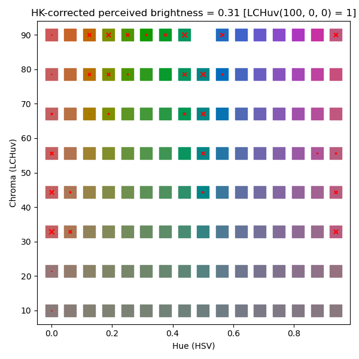
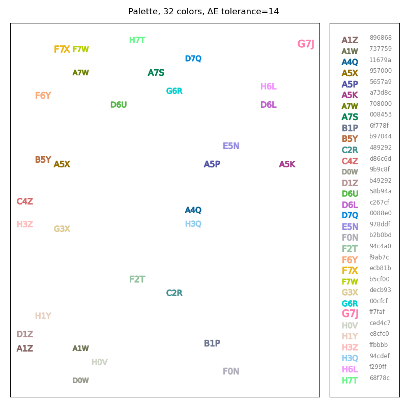

### WIP CODEBASE

## Description


This repo contains code to generate pleasing
[HK effect](https://en.wikipedia.org/wiki/Helmholtz%E2%80%93Kohlrausch_effect)
-corrected color palettes with distinguishable colors. The main aim is to aid in
color scheme design.

### Base Colors

First, a 3D grid of color points is created that is spaced regularly in
`(hue, chroma, perceived brightness) = (h, c, b)` coordinates. The hue corresponds
to HSV hue for the gamut being used -- currently all results are for sRGB. The
chroma value is of LCHuv, and the HK-correction applied uses coefficients 
defined in Kaiser, 1986[1], referenced from Donofrio, 2011[2]. This grid is
defined to cover 1024 target values: 16 hues x 8 chroma x 8 brightness.

For each such target point in this colour space a minimization routine is used
to find the HSV input that converts to it. For much of the target region a zero-loss
solution is found. However, high-chroma values around hue = 150 and medium-chroma
regions around hue = 0 are problem areas with high residual losses -- that is,
no HSV inputs exactly the desired target.
Below is an example of a plane of fitted colors for a fixed brightness. A red x means
high loss-approximation. One color from this plane was rejected because residual loss
was above tolerance.
this: 

All generated HCB colors are assigned names according to their target `(h, c, b)`
in the namespace `"[A-H][0-7][J-NP-Z]"`, chosen not to conflict with existing color notation
The prefix corresponds to the brightness, ranging A-H, from dark to bright. The
number corresponds to the LCHuv `C` chroma value, ranging 0 to 8, from
colourless to pure. The suffix corresponds to HSV hue, ranging J-Z, skipping O,
from 0 to 338 hue.

### Palettes

Concrete palettes with a workable number of colors are generated by finding a
maximal independent set on the graph induced on these colours by linking any two
nodes with a [ΔE](https://en.wikipedia.org/wiki/Color_difference#CIEDE2000)
under a threshold. This process gives a collection of colors no two of which are
too close to one another; this eliminates overlaps in the HCB grid caused by poor
convergence of the optimizer. For reasonable thresholds this is highly
nondeterministic and produces varied palettes. This diversity can be traded for
a larger number of colors by selecting the largest palette from multiple
restarts of the MIS algorithm.

The output as it is right now looks something like
this: 

### Future Work

It remains to flesh out support for different colorspaces + illuminants (for different
monitors and working conditions) as well as other
ΔE metrics (for example to allow colorblindness-friendly palette
generation).


A means to produce palettes meeting additional constraints, such as minimum number of colors of
some brightness, chroma or hue should be added.

### Bonus: fast color converters

In order to create these paletters, this repo contains a number of `@njit`
-decorated vectorized color conversion functions. They are very, very fast and
are a great choice where the more OO-style converters from libraries
like `colour-science` or `colour-math`
are unsuitable. These functions are tested to reproduce identical results to
those in
`colour-science`.

```
HSV_to_RGB_jit(__colmat_hsv): 7.74e-08 seconds per call per color for 10000 rows
sRGB_to_XYZ_jit(__colmat_rgb): 6.02e-08 seconds per call per color for 10000 rows
xyY_to_XYZ_jit(__colmat_xyy): 4.77e-09 seconds per call per color for 10000 rows
XYZ_to_xyY_D65_jit(__colmat_xyz): 2.18e-08 seconds per call per color for 10000 rows
XYZ_to_Luv_D65_jit(__colmat_xyz): 2.38e-08 seconds per call per color for 10000 rows
XYZ_to_Lab_D65_jit(__colmat_xyz): 5.22e-08 seconds per call per color for 10000 rows
Luv_to_LCHuv_jit(__colmat_luv): 3.01e-08 seconds per call per color for 10000 rows
Lab_to_LCHab_jit(__colmat_luv): 3.01e-08 seconds per call per color for 10000 rows
dE_2000_jit(__colmat_luv[:-1], __colmat_luv[1:]): 1.74e-07 seconds per call per color for 9999 rows

```

### References
[1]: Kaiser, P. K., CIE Journal 5, 57 (1986)
[2]: Donofrio, R. L. (2011). Review Paper: The Helmholtz-Kohlrausch effect. Journal of the Society for Information Display, 19(10), 658. doi:10.1889/jsid19.10.658