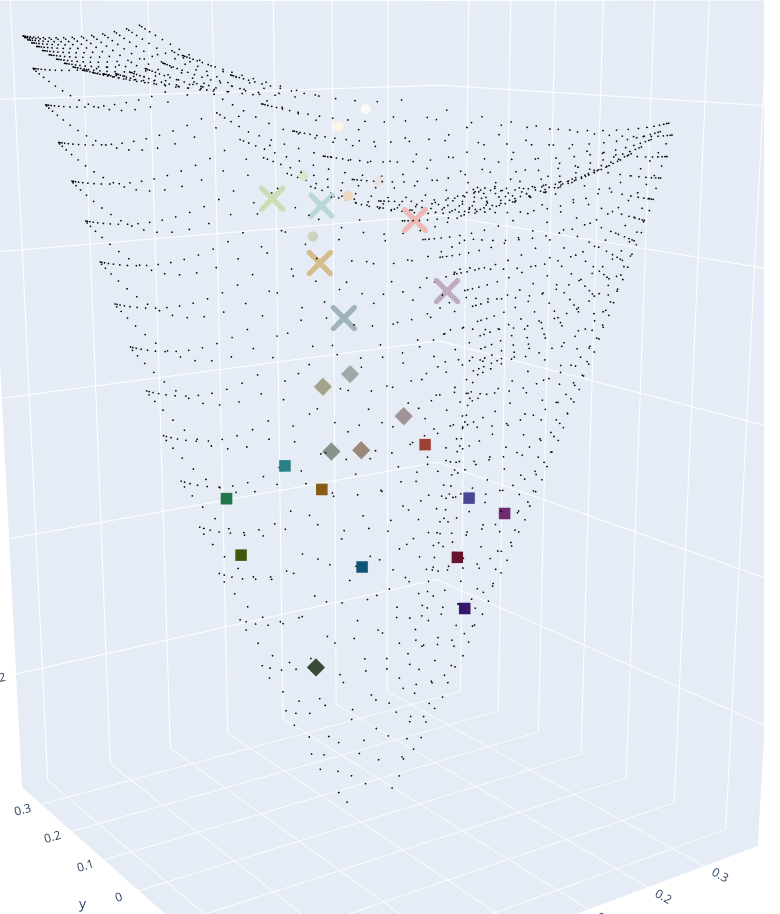
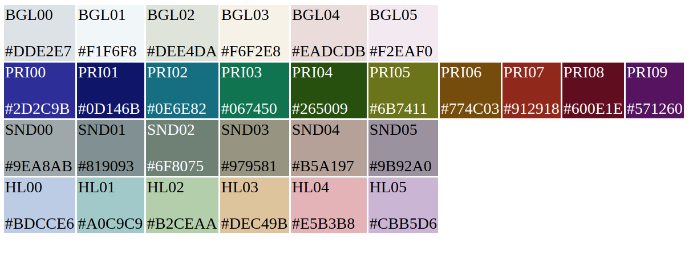

## Summary

This repo contains code to generate pleasing color palettes for on-screen color
schemes. It incorporates a rube-goldberg heap of corrections for various defects
in existing models, such as
the [HK effect](https://en.wikipedia.org/wiki/Helmholtz%E2%80%93Kohlrausch_effect)
.

This includes an original, advanced color model and enough low-level user
controls to give UX professionals irreparable brain damage.

## Intellij Color Scheme Generation (Cool Shit)

When installed with `pip`, this repo provides a script, `palette-gen` that is
able to:

1. Go from declarative specifications of abstract palettes to concrete palettes
2. Go from a declarative yaml specification of a Jetbrains color scheme and a
   palette produces as above to a full .xml scheme usable by IDEA
   
### Palette Generation
The input file looks something like this:
```yaml
name: SchemeName
views:
    Day:
        T: 6500
        Lsw: 100
        Lmax: 60
        Lb: 40
        bg_hex: "#e8e8e8"
palette:
    ult:
        type: jab_ring
        args:
            n_colors: 6
            m_lb: 27.0
            m_ub: 27.0
            j_lb: 0.54
            j_ub: 0.54
```

A more complete file is given in the examples folder. These parameters map
closely to the internal details of the PUNISHEDCAM colorspace and color solvers
as defined in the Internals section, which you should feel free to read if you're
some sort of freak who likes reading. If you're normal, just, like, mess around
with the numbers and the sections until something looks good.

The way to generate an actual palette is:

`palette-gen palette <that file>`

You may pass an `--html` flag to also produce a modern, responsive webpage
showcasing the colors you have just produced for rapid iteration.

### IDEA Scheme Generation

This is done as follows:

`palette-gen scheme <scheme yaml> <generated palette yaml>`

The generated palette yaml is, as the astute reader might guess, the file
produced by `palette-gen palette`. The scheme file hews quite closely to the
`.icls/.xml` Jetbrains color scheme files, except that automatic generation
makes it roughly 100 times faster to work with.

Any string in a color-typed key in the scheme file will be looked up among
the colors defined by the palette and replaced with its value. When customizing
the scheme, use YAML anchors like your life depends on it, or it will become
unmanageable. There is also no good way to enumerate all possible keys you
might want to customize, so it's good to update the scheme from time to time
with manual changes and additions you make from the IDEA GUI.

If you're installing the file directly and not through a theme, rename it
to end in `.icls` because IDEA is too stupid to let you import `.xml` schemes
directly.

## Internals (Nerd Shit)

### Color Model

I use the CIECAM02 color model with a grab-bag of changes from various papers ,
which I collectively term PUNISHEDCAM, to generate balanced color schemes. The
exact modifications applied can be found in the comments in `punishedcam.py`;
they are also cited below.

To use the model, an estimate for the viewing conditions should be specified,
since I eschew the grey-world assumption common to most consumer-grade CIECAM02
libraries. Specifically, in PUNISHEDCAM, one specifies:

- the tristimulus of the (adapted) whitepoint
- the absolute luminance of the reference white in the surround field
- the gaussian-weighted luminance of the 13° viewing field
- the absolute luminance of the brightest point in the 2° standard field

While this is all very complicated to do well, ass-pulled guesstimates work just
fine; indeed, since the model itself is ass-pulled, it would be a mistake to
devote too much effort to specifying these parameters with precision.

This model allows us to perform numerical optimization on collections of colors
in a modified Jab-UCS-like space. To avoid confusion with the standard CIECAM02,
I will refer to PUNISHEDCAM values with the suffix 'p, though this is not
present in the code.

### Palettes

To use the above color model to get actual colors, the user defines an arbitrary
number of palettes specified by (all in RGB):

- a background color
- the number of colors
- two-sided hinge losses for:
    - distance ΔJab'p from the background
    - colorfulness M'p
    - corrected lightness J'p
    - the maximum hue gap Δh'p

Given this specificaiton and the viewing conditions, the model performs a global
optimization step to find the best collection of RGB input points that, when
transformed, minimize the combined loss.

The crux of the algorithm is that in addition to the hinge losses above, the
model attempts to maximize the log of the minimum pairwise ΔJab'p distance
between the candidate colors. This minimum distance maximization is really what
provides that variety, exuberance and joie-de-vivre to the output.

### Worked Example

This sections walks through the internals of computing a full palette.

#### Viewing Conditions

I "work" at night in a dim room and think dark themes are way too mainstream, so
I want a dim-light friendly light color scheme.

First, I specify my viewing conditions. My room is dim, but my screen will have
a lot of white, so I specify:

`NIGHT_VIEW_LIGHT = ViewingSpec("night_light", T=6000, Lsw=1, Lmax=15, Lb=8)`

Be careful here -- light perception is logarithmic, so the "day" scheme will
have something like `Lsw = 100` or even `1000`. Monitors usually cap out at
around `70 cd m^-2`, but don't take my word for it -- I'm winging it.

Be careful again -- if you use redshift and set the screen temperature to, say,
5000K, that is _not_ the temperature that goes in there. Redshift works by
abusing some gamma values in the `crtc`, so the adapted white point will depend
on what is actually on your screen in a complicated way. The proper way to
support redshift is at the RGB-XYZ matrix level, which is currently not
implemented. soz.

#### Palette Spec

With that out of the way, let's define some palettes. Here's just the one for
what I call primary colors, shadowing the more common usage.

```python
primaries := HingeMinDistSolver(
    name="PRI",
    n_colors=(nc := 10),
    m_hinge=HingeSpec(17.5, 25.0, 1.0),
    j_hinge=HingeSpec(0.30, 0.50, 10.0),
    de_hinge=HingeSpec(0.40, 0.90, 10.0),
    hue_gap_hinge=HingeSpec(0.0, 1.5 / nc, 5.0),
),

```

This call instantiates a solver object with a collection of parameters which
define how we wish to find colors, how many we wish to find, etc.

#### Hinge loss

The class above tries to maximize the minimum pairwise distance between colors in
Jab'p space while respecting certain bounds with a hinge loss.

The hinge loss returns 0 if the parameter in question is between the first two
arguments; or, if not, the third argument times the distance from the zero-loss
zone. For example, here the hue gap loss kicks in if the largest hue gap between
my colors is over 48 degrees, and punishes by ~0.14 per degree above this (
internally, hue ranges between 0 and 1).

I leave it to the reader to figure out the details of the other hinges -- the
relevant implementation is in `palette_loss` in `palette_solver.py`


#### Jab Ring and other Solvers

The `HingeSpec` actually implements the following interface:

```python
class ColorSolver:
  def solve_for_context(self, bg_hex: str, vs: ViewingSpec) -> Iterable[Color]:
  def construct_from_config(cls: Type[T], conf: dict[str, Any]) -> T:
```

Any class that implements the first method will be usable by the `PaletteSolver`
described below to be combined with other `ColorSolver` specification into
a single output.

If the class also implements the `construct_from_config` method, it will be
usable in the declarative batch-processing infrastructure described in
the previous section, as long as it is faithfully constructible from the
defined configuration sections.

#### Output

Enough with boring-ass implementation details. How do we get the colors? As
below: I add some more palettes to the spec and define a background color.
Then, all that's left is to fire up the optimizer.

```
scheme = PaletteSolver(
    "Restraint",
    bg_hex,
    vs=NIGHT_VIEW_LIGHT,
    palettes=spec_dict,
)
```

This class accepts a map of names to `ColorSolver` objects, and creates
a dictionary of lists of solved colors on construction. Easy, breezy, colourful!

To debug our work, the `ColorScheme` class defines a `draw_cone` method, which
plots our palettes within the bounds of the Jab'p gamut defined by our RGB gamut
and view conditions:



This is an interactive plot that is useful for debugging hinge bounds for your
palettes and seeing their interplay. When you are happy with this, you may use
the `dump_html()` method to generate a modern, responsive HTML output:



And you are done!

#### Machine-readable colors

The `ColorScheme` class also provides a `serialize()` method that reduces
the solved colors to a JSON-friendly dictionary of primitives as seen below (in
YAML format):
```yaml
view_name:
    palette_spec_name:
        - name: color_name
          hex: '#dead00'
```

A complete output can be seein in `examples/example_output.palette.yaml`

This is intended to be used with the declarative palette generation functionality
of the installed `palette-gen` script. Example palette and spec inputs are also
provided. Independent code exploration is ~~encouraged~~ mandated by my
disinclination to write more documentaiton at this point in time.

## Future Work

sRGB is defaulted in many parts of the code with no easy controls to use another
gamut for one's monitor. Changing this is all the more important since redshift
and friends work by abusing the per-channel gamma, which means to support those
we need to be able to freely switch RGB-XYZ matrices.

Other than that, this codebase is just about perfect imho.

## Motivating Quotes

_Why settle for Solarized when you can be your own Solarized?_

_PUNISH yourself to liberate your inner colors!_

_The future isn't just bright -- it has configurable luminance._

## Bonus: fast color converters

In order to create these palettes, this repo contains a number of `@njit`
-decorated vectorized color conversion functions. They are very, very fast and
are a great choice where the more OO-style converters from libraries
like `colour-science` or `colour-math`
are unsuitable. These functions are tested to reproduce identical results to
those in `colour-science`.

```
HSV_to_RGB_jit(__colmat_hsv): 7.74e-08 seconds per call per color for 10000 rows
sRGB_to_XYZ_jit(__colmat_rgb): 6.02e-08 seconds per call per color for 10000 rows
xyY_to_XYZ_jit(__colmat_xyy): 4.77e-09 seconds per call per color for 10000 rows
XYZ_to_xyY_D65_jit(__colmat_xyz): 2.18e-08 seconds per call per color for 10000 rows
XYZ_to_Luv_D65_jit(__colmat_xyz): 2.38e-08 seconds per call per color for 10000 rows
XYZ_to_Lab_D65_jit(__colmat_xyz): 5.22e-08 seconds per call per color for 10000 rows
Luv_to_LCHuv_jit(__colmat_luv): 3.01e-08 seconds per call per color for 10000 rows
Lab_to_LCHab_jit(__colmat_luv): 3.01e-08 seconds per call per color for 10000 rows
dE_2000_jit(__colmat_luv[:-1], __colmat_luv[1:]): 1.74e-07 seconds per call per color for 9999 rows

```

### References

[1]: Kaiser, P. K., CIE Journal 5, 57 (1986)

[2]: Donofrio, R. L. (2011). Review Paper: The Helmholtz-Kohlrausch effect.
Journal of the Society for Information Display, 19(10), 658. doi:
10.1889/jsid19.10.658

[3]: Kim, M., Jo, J.-H., Park, Y., & Lee, S.-W. (2018). Amendment of CIECAM02
with a technical extension to compensate Helmholtz-Kohlrausch effect for
chromatic characterization of display devices. Displays. doi:
10.1016/j.displa.2018.09.005

[4]: Park, Y., Luo, M. R., Li, C. J., & Kwak, Y. (2014). Refined CIECAM02 for
bright surround conditions. Color Research & Application, 40(2), 114–124. doi:
10.1002/col.21872

[5]: Sun, P. L., Li, H. C., & Ronnier Luo, M. (2017). Background luminance and
subtense affects color appearance. Color Research & Application, 42(4), 440-449.

[6]: Luo, M. R., Cui, G., & Li, C. (2006). Uniform colour spaces based on
CIECAM02 colour appearance model. Color Research & Application: Endorsed by
Inter‐Society Color Council, The Colour Group (Great Britain), Canadian Society
for Color, Color Science Association of Japan, Dutch Society for the Study of
Color, The Swedish Colour Centre Foundation, Colour Society of Australia, Centre
Français de la Couleur, 31(4), 320-330.